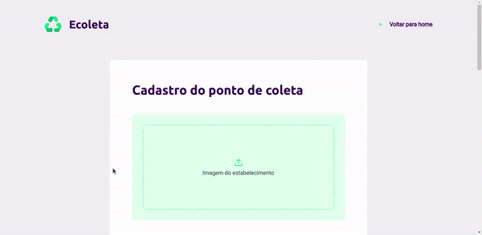
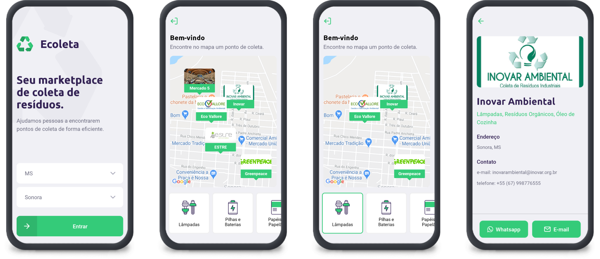

# :recycle: ecoleta

<h1 align="center">
  
</h1>

<h4 align="center"> 
	:heavy_check_mark:  NextLevelWeek 1.0 :rocket: Done! :heavy_check_mark:
</h4>

<div align="center">

[](https://img.shields.io/github/repo-size/thalysonalexr/ecoleta?color=34CB79&label=size&style=flat-square)
[](https://github.com/thalysonalexr)
[](https://img.shields.io/github/languages/count/thalysonalexr/ecoleta?color=34CB79&style=flat-square)
[](https://github.com/thalysonalexr/ecoleta/stargazers)
[](https://img.shields.io/github/last-commit/thalysonalexr/ecoleta?color=%2334CB79&style=flat-square)
[](https://img.shields.io/github/license/thalysonalexr/ecoleta?color=34CB79&style=flat-square)
</div>

<p align="center">
  <a href="#information_source-sobre-o-projeto">
    <strong>Sobre o projeto</strong>
  </a>&nbsp;&nbsp;&nbsp;|&nbsp;&nbsp;&nbsp;
  <a href="#whale2-infra">
    <strong>Infra</strong>
  </a>&nbsp;&nbsp;&nbsp;|&nbsp;&nbsp;&nbsp;
  <a href="#rocket-tecnologias">
    <strong>Tecnologias</strong>
  </a>&nbsp;&nbsp;&nbsp;|&nbsp;&nbsp;&nbsp;
  <a href="#tada-novas-features">
    <strong>Novas Features</strong>
  </a>&nbsp;&nbsp;&nbsp;|&nbsp;&nbsp;&nbsp;
  <a href="#information_source-como-utilizar">
    <strong>Como utilizar</strong>
  </a>&nbsp;&nbsp;&nbsp;|&nbsp;&nbsp;&nbsp;
  <a href="#thinking-como-contribuir">
    <strong>Como contribuir</strong>
  </a>&nbsp;&nbsp;&nbsp;|&nbsp;&nbsp;&nbsp;
  <a href="#rainbow-layout">
    <strong>Layout</strong>
  </a>&nbsp;&nbsp;&nbsp;|&nbsp;&nbsp;&nbsp;
  <a href="#memo-licença">
    <strong>Licença</strong>
  </a>&nbsp;&nbsp;&nbsp;|&nbsp;&nbsp;&nbsp;
</p>

## :information_source: Sobre o projeto

O projeto **Ecoleta** foi desenvolvido durante a primeira edição da **Next Level Week** realizado pela **@Rocketseat**. O projeto tem como intuíto ser um marketplace de coleta de resíduos, ajudando pessoas a encontrarem pontos de coletas mais próximos para descartarem diferentes tipos de lixos.

### aplicação Web

<div align="center">
  
</div>

### aplicação mobile

<div align="center">
  
</div>

## :whale2: Infra

Assim como em outros projetos utilizei [**Docker**](https://www.docker.com/) e [**Docker Compose**](https://docs.docker.com/compose/) para criar uma infraestrutura com as imagens do NodeJS e Postgres para desenvolvimento da API. Veja o arquivo [docker-compose.yml](https://github.com/thalysonalexr/ecoleta/tree/master/server/docker-compose.yml)

## :rocket: Tecnologias

- API com [**NodeJS**](https://nodejs.org/en/)

    - [TypeScript](https://www.typescriptlang.org/)
    - [Express](https://expressjs.com/pt-br/)
    - [TypeORM](https://typeorm.io/#/)
    - [Postgres](https://github.com/brianc/node-postgres)
    - [Tsconfig paths](https://github.com/dividab/tsconfig-paths)
    - [Jest](https://github.com/facebook/jest)
    - [...](https://github.com/thalysonalexr/ecoleta/tree/master/server/package.json)

- Web com [**ReactJS**](https://pt-br.reactjs.org/)

    - [TypeScript](https://www.typescriptlang.org/)
    - [Leaflet](https://react-leaflet.js.org/)
    - [Axios](https://github.com/axios/axios)
    - [Dropzone](https://react-dropzone.js.org/)
    - [...](https://github.com/thalysonalexr/ecoleta/tree/master/web/package.json)

- Mobile com [**React Native/Expo**](https://expo.io/)

    - [TypeScript](https://www.typescriptlang.org/)
    - [React Navigation](https://reactnavigation.org/)
    - [React Native Maps](https://github.com/react-native-community/react-native-maps)
    - [Axios](https://github.com/axios/axios)
    - [...](https://github.com/thalysonalexr/ecoleta/tree/master/mobile/package.json)

## :tada: Novas features

Durante a semana foi utilizado a lib [**Knex**](http://knexjs.org/) com o banco de dados sqlite, porém a fim de me aprofundar um pouco mais no universo TypeScript, optei pela lib TypeORM e utilizei o banco de dados postgres.

Também utilizei **tsconfig-paths** para obter caminhos mais "amigáveis" durante o desenvolvimento, e Jest para realizar testes de integração e unidade. Você pode ver o coverage [**clicando aqui**](https://github.com/thalysonalexr/ecoleta/tree/master/server/docs/tests-coverage.png).

Você também pode testar a API com o cliente de requisições [**Insomnia**](https://insomnia.rest/download/), basta clicar no botão abaixo para obter o [**workspace**](https://raw.githubusercontent.com/thalysonalexr/ecoleta/master/server/docs/insomnia.json):

[](https://insomnia.rest/run/?label=Ecoleta%20API&uri=https%3A%2F%2Fraw.githubusercontent.com%2Fthalysonalexr%2Fecoleta%2Fmaster%2Fserver%2Fdocs%2Finsomnia.json)

Além do Docker e as features mencionadas também foi desenvolvido ambientes de **testes**, **desenvolvimento** e **produção**, você pode ver como executá-los com scripts npm [**aqui**](https://github.com/thalysonalexr/ecoleta/tree/master/server/package.json).

## :information_source: Como utilizar

Para clonar este repo e executar a aplicação você precisa ter Git e Yarn instalados. Caso utilize este tutorial irá precisar do Docker e Docker compose ou ter o NodeJS e Posgres instalados.

### banco de dados

Você precisará criar o [arquivo de configuração](https://typeorm.io/#/using-ormconfig) do banco de dados, no TypeORM existem diversas maneiras para configurar eu optei pela configuração através de arquivo `.json`. Também deixei pronto um [exemplo de configuração](https://github.com/thalysonalexr/ecoleta/tree/master/server/ormconfig.example.json), basta renomear o arquivo removendo `.example` para que o TypeORM reconheça. Perceba que apenas as configurações de produção que eu deixei em aberto e as de `development` e `test` estão alinhadas a este repo.

### variáveis de ambiente

Configurei 3 tipos de arquivos a serem lidos de acordo com o ambiente (**teste, desenvolvimento e produção**). O arquivo tem o mesmo formato que `.env.example` que deve ser replicado para `.env`, `.env.dev`, `.env.test` e lá você deverá colocar as configurações destes ambientes seja com Docker ou não.

### instalar e executar a API

```bash
# clone o repo
$  git clone https://github.com/thalysonalexr/ecoleta.git

# vá até o diretório
$ cd ecoleta/server

# instale as dependências (ou deixe o docker fazer isto)
$ yarn install 

# suba os containers do nodejs e postgres
$ docker-compose up

# entre no bash do container do nodejs
docker exec -it ecoleta-server /bin/sh -c "[ -e /bin/bash ] && /bin/bash|| /bin/sh"

# execute o script para as migrations
~/server $ yarn migrations:dev:run

# e para os seeds
~/server $ yarn seeds:dev:run

# para testar basta executar
~/server $ yarn test
```

> Infelizmente o [TypeORM não cria o banco de dados](https://github.com/typeorm/typeorm/issues/809), então antes de executar as migrações você precisa criar o banco `ecoleta` e `ecoleta-test` (para testes) na instancia do postgres criada pelo docker. Você também irá notar que as seeds executas na verdade são apenas migrações pois atualmente o TypeORM também não suporta tal funcionalidade.

Você pode ver o que faz outros scripts no [`package.json`](https://github.com/thalysonalexr/ecoleta/tree/master/server/package.json).

Caso você queira trabalhar apenas com as aplicações Web e Mobile, você pode estar consumindo da [API](https://api-ecollectage.herokuapp.com/v1/) diretamente em produção hospedada em [Heroku Cloud](https://dashboard.heroku.com/).

Endpoint: `https://api-ecollectage.herokuapp.com/v1/`

Exemplo: [`https://api-ecollectage.herokuapp.com/v1/items`](http://api-ecollectage.herokuapp.com/v1/items)

### instalar e executar a aplicação Web

```bash
# clone o repo
$ git clone https://github.com/thalysonalexr/ecoleta.git

# vá até o diretório
$ cd ecoleta/web

# instale as dependências
$ yarn install

# execute
$ yarn start

# running on port 3000 (default)
```

### instalar e executar a aplicação Mobile

```bash
# clone o repo
$ git clone https://github.com/thalysonalexr/ecoleta.git

# vá até o diretório
$ cd ecoleta/mobile

# instale as dependências
$ yarn install

# execute
$ yarn start

# O Expo será aberto, basta digitalizar o qrcode no terminal ou na página da exposição através do app expo instalado em seu dispositivo

# Se você tiver algum problema com as fontes, execute
$ expo install expo-font @expo-google-fonts/ubuntu @expo-google-fonts/roboto
```

## :thinking: Como contribuir?

- Faça um fork do projeto;
- Crie um branch com sua feature: `git checkout -b my-feature`;
- Faça commit das adições/alterações: `git commit -m 'feat: My new feature'`;
- Faça um push para seu branch: `git push -u origin my-feature`;
- Abra uma solicitação pull request para o repo original :heart:.

## :rainbow: Layout

Veja o layout das aplicações mobile e web em [**Figma**](https://www.figma.com/file/1SxgOMojOB2zYT0Mdk28lB/).

## :memo: Licença

Lançado em 2020. Este projeto está sob a [**licença MIT**](https://github.com/thalysonalexr/ecoleta/blob/master/LICENSE)

Desenvolvido com :heartbeat: por [**Thalyson Rodrigues**](https://www.linkedin.com/in/thalysonrodrigues/)
